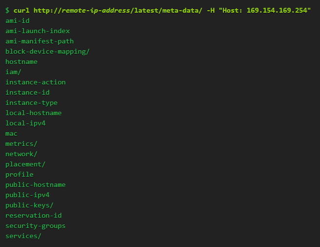

## 1. Vulnerability Description
* If you set the wrong proxy setting in nginx, sensitive information may be leaked.
* Set the HOST header value to $host value in HTTP requests if /etc/nginx/sites-available/default.conf has the following settings<br>
An attacker can set up a specific server in the HOST header to send HTTP requests to that server and receive results.<br>
If nginx is acting with DMZ privileges, an attacker may also be able to access a server that is not directly accessible.<br>
These forward‐proxy settings can also be used to hide the requested source IP.

```
# Don't ever use 'proxy_pass' like this!
location / {
    proxy_pass http://$host; # To repeat: don't do this!
}
```

* Some cloud companies offer APIs to enable services running on VMs to query for "instance metadata" that can contain sensitive information such as credentials.
  * Amazon Web Services (AWS) – [Instance Metadata and User Data](https://docs.aws.amazon.com/AWSEC2/latest/UserGuide/ec2-instance-metadata.html)
  * Google Cloud Platform – [Storing and Retrieving Instance Metadata](https://cloud.google.com/compute/docs/storing-retrieving-metadata)
  * Microsoft Azure – [Instance Metadata Service](https://docs.microsoft.com/en-us/azure/virtual-machines/windows/instance-metadata-service)
* By publishing metadata from internal or non-routed IP addresses, companies assume it is safe, but access is possible due to incorrect proxy settings. 
Below is the content of checking metadata using AWS API.




## 2. Vulnerability Countermeasure
* Set the pre-selected upstream server to proxy traffic. Do not set the proxy server through user input, such as "proxy_pass http://$host".
* Detect and monitor settings of nginx using [NGINX Amplify] (https://www.nginx.com/products/nginx-amplify)
* Drop for requests with strange host header values
