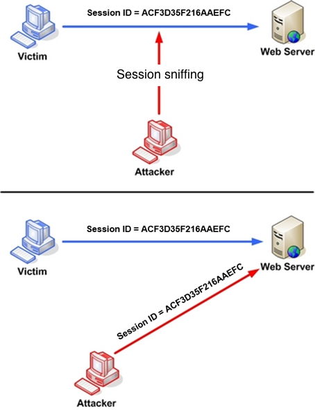

## 1. Vulnerability Description
* Session Hijacking is sent without SSL, or with a consistent session ID used for session management when browsing the web.<br>
A vulnerability in which the possibility of theft exists through sniffing or brute-force guessing.


[ picture 1. vulnerability example ]


## 2. How to check vulnerability
* Check if Session ID has a certain rule and can be extorted through brute-force or guessing.
* Ensure that SSL is applied to prevent sniffing.

## 3. Vulnerability Countermeasure
### Encryption over SSL
* Enforce encryption over SSL when sending Session ID.
 
### Generate Secure Session ID
* Set the Session ID generation range value to a value large enough relative to the number of users.
The Session ID is generated as random as possible. 
When making brute-force attacks, an attacker must spend as much time as possible, and the probability of finding a valid session ID value that is currently connected and active is reduced.

### Set cookie security to ensure session ID is passed securely
* Set session forwarding mode to Cookie mode.
* Set the property value of the session cookie to HttpOnly (an option that prevents attacker from viewing cookies with JavaScript, such as docum.cookie).

#### How to set HTTP Only
* If Tomcat 6 or higher, set in context.xml

```xml
<?xml version=""1.0"" encoding=""UTF-8"">
<Context path=""/myWebApplicationPath"" useHttpOnly=""true"">
```

* Java 6 or later, Servlet 3.0 supported

```java
Cookie cookie = getMyCookie(""myCookieName"");
cookie.setHttpOnly(true);
```

* Settings in WEB-INF/web.xml

```xml
<session-config>
	<cookie-config>
		<http-only>true</http-only>
	</cookie-config>
</session-config>
```

* If PHP 5.2.0 or higher, set as below

```php
session.cookie_httponly = True
```


#### Enable Session Timeout and Session ID Playback.
* Users who are inactive for a certain period of time should be re-logged with a new Session ID and discard the Session ID value when the user logs out.
* For applications that require long-term access, automatically regenerate the Session ID value at a certain interval to maintain the session.
