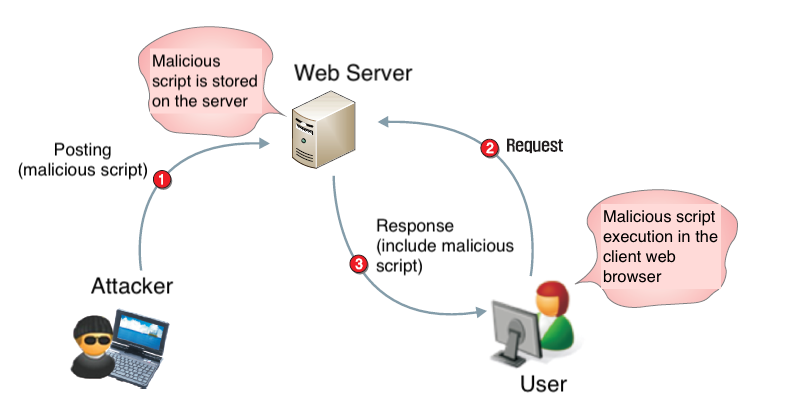
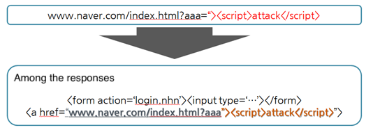
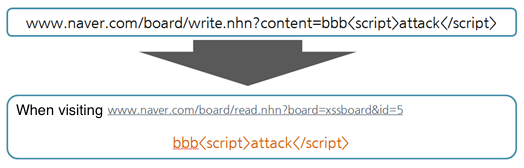
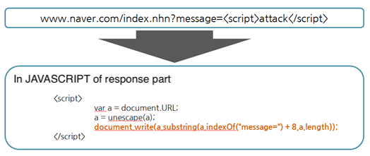
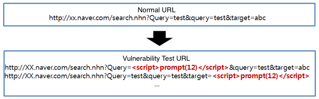
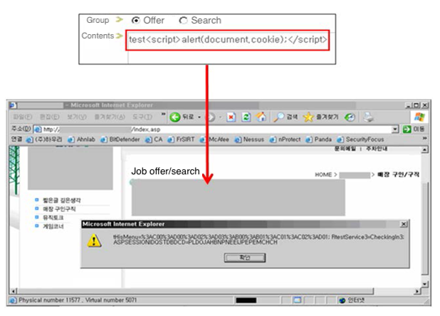
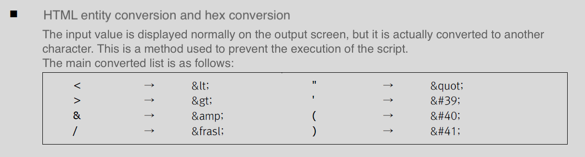

## 1. Vulnerability Description
* A technique that executes a script at the client side (browser) because the web application that receives and processes user input does not properly verify the input value.<br>
If the entered content contains malicious scripts, the user who reads the content may be harmed by the execution of an unintended script.
* Attack using these vulnerabilities is called Cross-Site Scripting (XSS) and can be attacked in various script types such as VBScript, XML, Javascript, HTML, etc., depending on the environment. The XSS attack is based on the following scenarios:



* If a malicious script registered by a hacker is exposed to another user, the user will automatically perform an unintentional action, typically with the following purposes:
  * Abuse authority by stealing cookies from other users
  * Encourage other users to perform certain actions (membership, withdrawal from account, rating adjustment, membership recommendation, forced entry/reference, etc.)
  * Guides malicious code execution and malicious ActiveX installation using known vulnerabilities
  * Move to a specific site and expose it to advertising
  * Attempt phishing attacks by moving to a specific site

There are three types of XSS: Reflected XSS, Stored XSS, and DOM Based XSS, each with the following characteristics:

### Reflected XSS
* If an attack entered in the parameter is still present in the response.



### Stored XSS
* Exploitation entered in Parameter is stored in DB, read through a different page, and the script runs.



### DOM Based XSS
* The page itself does not change as the attack entered into the Parameter is executed as part of the DOM creation, but the browser-side code contained on the page runs scripts in the DOM environment.




## 2. How to check vulnerability
To prove the vulnerability, simply enter a script to see if it runs. In a typical web environment, it is considered that a vulnerability exists if the desired HTML and JavaScript can be executed.

### Reflected XSS
* For each passing parameter (all parameters passed on page), when a specific script is entered and sent, verify that the script runs on the page that appears as response.



### Stored XSS or DOM Based XSS
* When a specific script is inserted in the input value part of the page and saved or requested, check whether the inserted script is executed in the page where the input value is exposed.




## 3. Vulnerability Countermeasure
### 3.1. Allow only characters in range to be used
* When a limited parameter in sequence number or method format is used, it is strictly checked or hardcoded through regex.
  * Example: Table values should only be alphabetic and "no", "page" should only be allow numbers.
The input value must be limited to the range of strings used, and other characters restrict the input.

```
http://www.target.com/board/read.do?table=qna&no=123&page=2
```

### 3.2. If Javascript is not allowed, the string used primarily in an attack is treated as a Black List to restrict input.

```
location=, href=, .open(, <script, javascript:, .cookie, .write, alert(, &#40, &#040, …
```

### 3.3. All arguments that do not need to allow HTML are processed as entities
* If the incoming parameters cannot be limited: ", ',  <, >, (, ), &, / characters are processed as HTML entities

```
Processing space(%0d,%0a,%0a0d) characters as null
````



* Web Encoding Utility
  * http://demo.nickname.net/demo/testpak/encode.pl 

```
< → &lt;
> → &gt;
" → &quot;
' → &#39;
& → &amp;
( → &#40
) → &#41
/  → &#47
```

### 3.4 When input values are output to JavaScript variables

#### (1) Do not use output of JavaScript variables, or take action using escapeJavaScript
* https://commons.apache.org/proper/commons-lang/javadocs/api-2.6/org/apache/commons/lang/StringEscapeUtils.html#escapeJavaScript(java.lang.String)
* https://commons.apache.org/proper/commons-lang/javadocs/api-2.6/src-html/org/apache/commons/lang/StringEscapeUtils.html#line.130

#### (2) Use HTML attribute without outputting JavaScript variable. data-xxxx = "html encoded value" etc.
