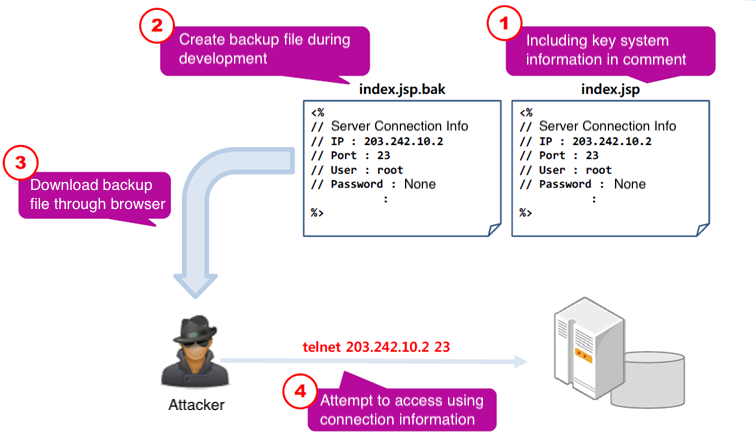
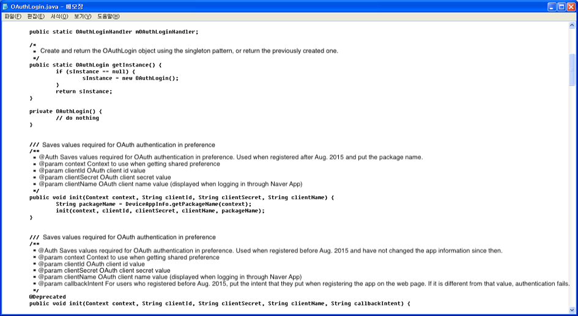

## 1. Vulnerability Description
* In some cases, information about the internal state of the system, such as key system information, may be exposed through information left by the software developer for convenience (information left in the comments, detailed error messages, debug message output, etc.) and through configuration mistakes (type setting, etc.) . The information exposed in this way can be used by a hacker to perform another attack and can be easily acquired through an automated attack tool, so the following actions must be taken to prevent exposure.
* User accounts, passwords, system key information, personal information, detailed comments about logic, etc. written in the code distributed in the real environment must also be clearly deleted when development is completed.
* When releasing the web source, make sure that the basic error messages are not printed and that the type settings are correct.



[Figure 1. Example of vulnerability]

## 2. How to check vulnerability
### 2.1. Review comments inside code
* Review the comments inside the code to see if they contain sensitive information.
* In particular, check in detail the comments of the code that implement the DB access/administrator function, etc.



[Figure 2. Case with detailed comments]

### 2.2. Check error messages
* Check if error message is printed

```
Input data type differently : ex) view.asp?no=test
Input value exceeds the acceptable range : ex) view.asp?no=-99999
Input special characters : ex) view.asp?no=’”
```
* Check if the error message contains sensitive information such as system environment, user information, and data.

### 2.3. Check type settings
* Although it has a valid server-side script file format that is normally processed by the web server,
the source is exposed in plain text format because the extension is not registered in the parsing list. One of the most common examples is the unparsing of inc files.
* When doing web programming, there are many cases where you use the library you used as it is.
In this case, you need to set the extension to parse on the web server to handle it properly, but it becomes a problem if the inc file is not set.


[Figure 3. Example of inc file exposure]

## 3. Vulnerability Countermeasure

### 3.1. Review comments inside code
* User accounts, passwords, system key information, personal information, and detailed comments about logic must be clearly deleted when development is completed.

### 3.2. Check error messages

#### Validation and exception handling for input values
* Check if there is an input value that falls within the disallowed form and range, and then handle an exception.

#### Collective linking to a separate error page
* When a user requests a non-existent web page, attempts to access an unauthorized page, or generates an error due to an incorrect input value.
* Unify the content of the returned message, create a separate error page that informs only brief information like "An error has occurred. Please try again", and then redirect to that page.

#### Change settings
##### PHP
* Add "On Error Rescue Next" to prevent errors.

#### Secure web programming
##### ASP
* Add "On Error Rescue Next" to prevent errors.
##### PHP
* Add @ in front of the function to prevent errors and handle exceptions.
* $data=@mysql_fetch_array($query) or die("This is a temporary error. Please try again later.");

## 4. Sample Code
#### Example of recording password information in the comment text to help the developer understand
* Vulnerable Java Code

```JAVA
...
public void daoTest() throwsException {
    // write password in the comment text to help the developer understand
    // dbsample : 84d5d0a08a3ec5e2d91a
    // before and after encryption : 1365ADMIN_01, aa84c40031d808196537ad3dcf81f9af
    String pwd = "aa84c40031d808196537ad3dcf81f9af";
    String pwd1 = ARIAEngine.decARIA(pwd);
    System.out.println(pwd1);
}
```

* Safe Java Code

```JAVA
...
public void daoTest() throwsException {
    // Delete comments containing the password
    String pwd = "aa84c40031d808196537ad3dcf81f9af";
    String pwd1 = ARIAEngine.decARIA(pwd);
    System.out.println(pwd1);
}
```

#### Examples of information exposure through error messages
* Vulnerable Java Code

```JAVA
try {
    rd = new BufferedReader(new FileReader(new File(filename)));
}
catch(IOException e) {
    e.printStackTrace(); //Stack information is exposed through an error message
}
```

* Safe JAVA Code

```JAVA
try {
    rd = new BufferedReader(new FileReader(new File(filename)));
}
catch(IOException e) {
    logger.error(“ERROR-01: File open error”); // Define error code and information separately, and log only minimum information
}
finally{
    try {
        rd.close();
    }
    catch (IOException ex) {
        logger.error(“ERROR-02: File close error”);
    }
}
```

