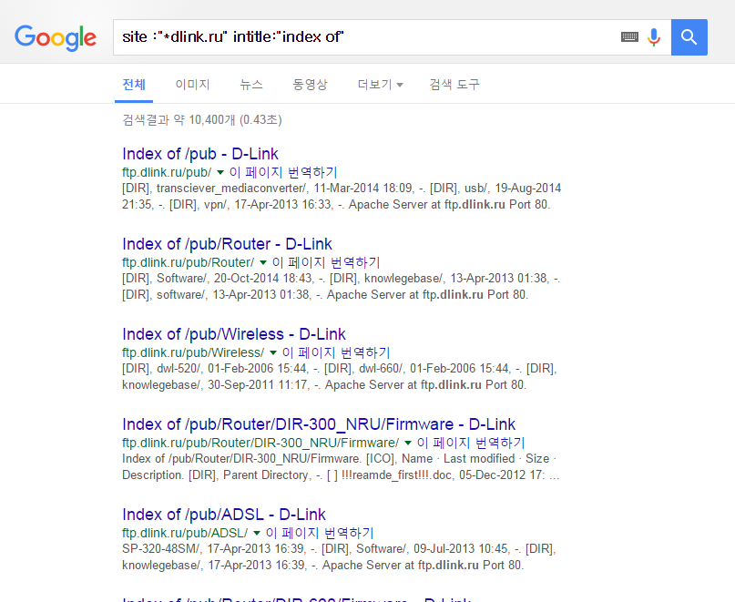

## 1. Vulnerability Description
* Vulnerabilities in which sensitive file information can be exposed because indexing is enabled for all directories within the Web server or for directories containing sensitive information.<br>
The vulnerability could allow an attacker to identify the structure of a web application system and attempt various attacks by exposing a configure file containing sensitive information.


* Directory listing may have vulnerabilities for the following reasons:

type | content
-- | --
If you have changed your web server settings to enable directory listings | Most web servers provide a directory listing function by default and Options enable you to turn on/off<br>If the administrator has set this option to On, the folder can be accessed in the way as http://www.target.com/data/, then a list of files and directories appears.
If an application's bug causes directory listing | This is a case of directory listing due to unintended results in a specific application. A typical example is the case where vulnerabilities were found in all versions of Resin 2.1.x and 3.x.<br>If there is no default page such as Index.html and index.jsp, it is possible by adding %3f.jsp behind a directory. (Example : http://www.target.com/data/%3f.jsp )<br>The same result occurs on the Netscape web server by entering /?wp-cs-dump, /?PageServices behind a domain.

## 2. How to check vulnerability
### 2.1 Direct Inspection Method
* Pre-check all subdirectories information on the web site being inspected.
* For all subdirectories in the Web root, enter their addresses in a web browser to check for directory listing vulnerabilities.

```
** Note **
If there is a directory called ""file"" under the web root of the web server called http://test.com/, enter http://test.com/file/ in the URL address field of the web browser.

At this time, if all the contents of the ""file"" directory are displayed on the screen, it means that a directory listing vulnerability exists, and you must enter'/' at the end.
````


* Add a specific string (%3f.jsp, /?wp-cs-dump, /?PageServices, etc.) to check if directory listings are made.


### 2.2. Check through Google
* the results of directory listings are the same for each type of web server, so some vulnerabilities are discovered by search engines.<br>
This means that vulnerabilities can be easily exposed to the outside by Googling, and the main patterns are as follows.<br>
Enter the site address in the domain setting field and the pattern keyword below in the search box to search for a page where directory listings are stored.

Web application | Directory listing exposure pattern
-- | --
IIS | Parent Directory
Apache | Directory Listing
Tomcat | Directory Listing
Resin, etc... | Index of /




## 3. Vulnerability Countermeasure
### 3.1. Change of Web Server configuration 
* Removes the directory indexing feature from the Web server configuration. The setup methods for each Web server are as follows.

#### IIS
* After selecting Settings>Control Panel>Administrative Tools>Internet Service Manager, right-click on the website, and uncheck "Search directory"" in the ""Home Directory"" tab of the properties.


#### Apache
* Remove "Indexes" from the Directory in the httpd.conf setup file during the options as follows: Indexes is an indicator that shows a list of files in that directory.
Restart the web service daemon to apply the configured information.

```
<Directory ""/var/www/html"">
Options Indexed
</Directory>
```

#### Tomcat
* After setting the directory listing blocking directive in the /conf/web.xml configuration file, restart the web service's daemon.

```
<param-name> listings </param-name>
<param-name> false </param-name>
```

#### Resin
* Set directory listing blocking directives in the resin.conf configuration file.

```
<doc-dir> doc </doc-dir>
<directory-servlet> none</directory-servlet>
```

### 3.2. Create Default Page on all directories below the Web root (index.html, index.asp, index.jsp, etc.)
* If it is not possible to change web server settings, it is a temporary countermeasure, but sometimes it may not apply.
 
#### 3.3 Additional countermeasure
* If an application's bug causes directory listing, update the application to the latest version where no vulnerabilities exist.<br>
You should modify the setting values of the web server where the vulnerability was found to remove it, and if it is exposed by re-checking the vulnerability on the Google search site, you should request the removal of information.
