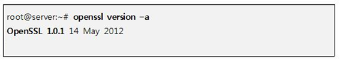

## 1. Vulnerability Description
* The weakness of FREAK (cve-2015-0204) is the vulnerability of downgrading SSL servers to allow RSA for export, and then obtaining RSA keys through a Brute-force decryption attack to carry out MITM attacks.

## 2. How to check vulnerability
* Check OpenSSL version



* Vulnerable Version Information

```
OpenSSL 0.9.8zd or earliar
OpenSSL1.0.0 ~ OpenSSL1.0.0p or earliar
OpenSSL1.0.1 ~ OpenSSL1.0.1k or earliar
```

## 3. Vulnerability Countermeasure
* OpenSSL 0.9.8 Users upgrade to OpenSSL 0.9.8zd.
* Users of OpenSSL 1.0.0 upgrade to OpenSSL 1.0.0p.
* Users of OpenSSL 1.0.1 upgrade to OpenSSL 1.0.1k.

## 4. Node
SSL/TLS Usage Recommendations (as of December 2019)


