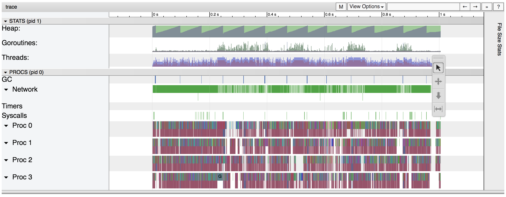

## 1. Vulnerability Description
* When using the net/http/pprof package, important information can be exposed through the output debug message.
* You can use the wget command below to see process-related information.

```
$ wget -O trace.out http://localhost:8080/debug/pprof/trace
$ go tool trace trace.out
```



## 2. Vulnerability Countermeasure
* Be sure to remove the net/http/pprof package when deploying to the operating network.

## 3. Sample Code
#### Vulnerable Code

```
package main

import (
	"fmt"
	"log"
	"net/http"
	_ "net/http/pprof" // it's dangerous.
)

func main() {
	http.HandleFunc("/", func(w http.ResponseWriter, r *http.Request) {
		fmt.Fprintf(w, "Hello World!")
	})
	log.Fatal(http.ListenAndServe(":8080", nil))
}
```

* In the case of setting as above, important information such as traffic can be checked at the url below

```
/debug/pprof/profile: 30-second CPU profile
/debug/pprof/heap: heap profile
/debug/pprof/goroutine?debug=1: all goroutines with stack traces
/debug/pprof/trace: take a trace
```
