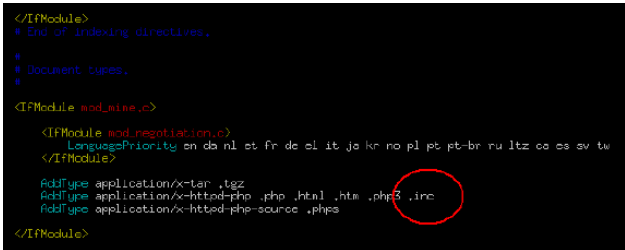

## 1. Vulnerability Description
Due to the nature of the Server Side Script, the Requester (Client) is unable to verify the source code under normal conditions because it is a browser that checks the results processed by the compiler. However, there may be vulnerabilities where source code is exposed to the outside world for a variety of reasons, and the acquired source code allows attackers to obtain sensitive information such as the path to class files, the path used to upload and download files, and the string of database connections.

#### The main causes of source code exposure are:

### 1.1 Server Side Script is Not Parsed
* Server Side Script file format normally handled by the Web server, but the source is exposed in the form of a plaintext because file extension is not registered in the parsing list. The most common example is unparsed .inc files. When programming the web application, you often use your library and you need to set file extension to be parsed on the web server to handle it properly, but not.


### 1.2. Application Bugs
* A particular application's bug exposes the source code:

```
- www.target.com//notice/config.jsp
- www.target.com/notice/config.jsp/
- www.target.com/notice/config.jsp//
- www.target.com/notice/config.jsp%00
- www.target.com/notice/config.jsp%23
- www.target.com/notice/config.jsp%5c
- www.target.com/notice/config.%61%73%70
- www.target.com/notice/config.JSP
```


## 2. How to check vulnerability
* For convenience, if the developer writes down the password or key information on the server in an comment, an attacker can access the system using the information exposed to the source code.


## 3. Vulnerability Countermeasure
### 3.1 Server Side Script is Not Parsed
All Server Side Scripts located within the Web server must be set up to register extensions so that the Web server can parse normally.

#### (1) IIS
* Administrative Tools - Internet Information Service - Web Site Properties – home directory – Configuration – Add
  * 예 : How to add inc file


#### (2) Apache
* httpd.conf
  * 예 : How to add inc file




## 4. Example Code
* When writing a code, credentials such as user accounts or passwords that are left on the comment should be deleted.
* Vulnerable Code

```java
// Password for administrator is ""tiger"" <-- Have to remove
public boolean DBConnect() {
    String url = ""DBServer"";
    String password = ""tiger"";
    Connection = null;
  
    try {
        con = DriverManager.getConnection(url, ""scott"", password);
    } catch {
        ...
    }
}
```

* Safe Code

```java
// Password should be deleted in comment
public Connection DBConnect(String id, String password) {
    String url = ""DBConnect"";
    Connection conn = null;
    try {
        String CONNECT_STRING = url + "":"" + id + "":"" + password;
        InitialContext ctx = new InitialContext();
        DataSource datasource = (DataSource) ctx.lookup(CONNECT_STRING);
        conn = datasource.getConnection();
    } catch (SQLException e) {
        ...
    }
    return conn;
}
```
