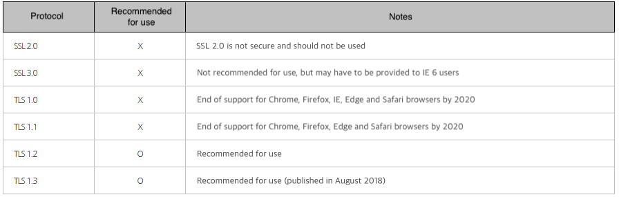
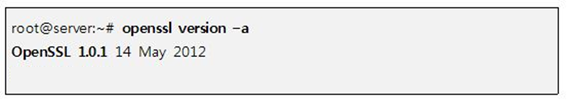

## 1. Vulnerability Description
* Unsafe SSL/TLS protocols and Ciphersuites can cause security issues.



[ Fig 1. SSL/TLS Protocol Security(As of Dec, 2019) ]


## 2. How to check vulnerability
* Check OpenSSL version



* Vulnerable versions

```
* OpenSSL 1.0.1 ~ OpenSSL 1.0.1f
* OpenSSL 1.0.2-beta, OpenSSL 1.0.2-beta1
```

* Affected Systems and Software
  * Systems with Vulnerable OpenSSL Version
     * Server (web server, VPN server, etc.), network equipment, mobile device, etc. may be applicable.
  * Software products with vulnerable OpenSSL libraries built in

## 3. Vulnerability Countermeasure
* Patch to secure openssl version below
```
OpenSSL 0.9.x 
OpenSSL 1.0.0
OpenSSL 1.0.1g
```
