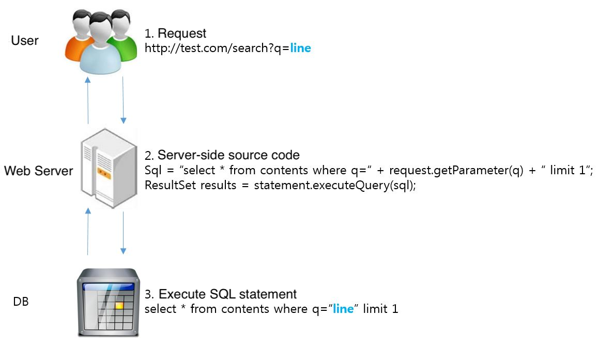
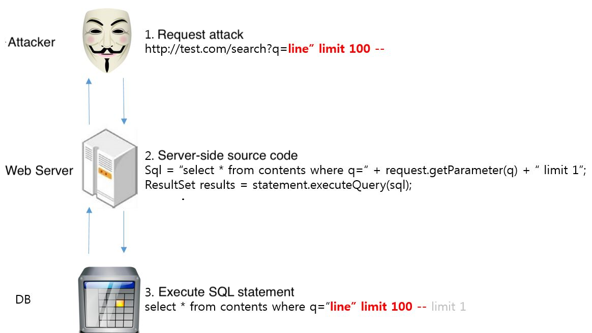
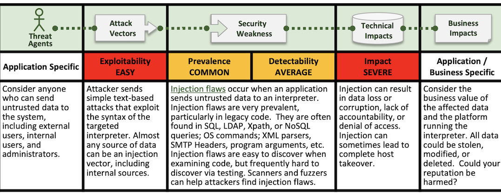

## 1. Vulnerability Description
* SQL injection : SQL Injection (SQLi) is a type of an injection attack that makes it possible to execute malicious SQL statements.
* These statements control a database server behind a web application. Attackers can use SQL Injection vulnerabilities to bypass application security measures.
* In a typical web environment, all parameters that the server receive and process can be used as statements for attack: 1) Query String 2) Body 3) Cookie 4) Headers of HTTP methods.


<Figure 1. Normal Scenario>


<Figure 2. Attack Scenario>

* Typically, you should assume that all data is unreliable. Although SQL Injection is dangerous from the perspective of information leakage by inquiring information from the DB, it becomes more serious when linked with hacking technology as shown below. An SQL Injection attack is not only limited to dumping a database, but can also allow the attacker to upload files to the remote server and consequently gain remote access via a WebShell.

#### (1) Upload files using procedures of file I/O + WebShell
* By using load_file, into outfile, into dumpfile, attackers can upload malicious files to a specific path and execute them.

#### (2) Reverse connection by using shell exeacution
* By using the things that enable shell execution such as sys_exec, xp_cmdshell, attackers can make reverse connection.


<Figure 3. Showing the attack and the Business impact of SQLi (OWASP 2013)>

* As you can see in Figure 3, It has features like "easy to attack," "easy to obtain automation tools," and "severe impact". Many attackers use SQLi because it is easy to use, furthermore the damage is a huge.
In fact, a lot of sites attacked by attackers by SQL injection, and there are cases where large amounts of information were leaked.

#### Case of personal information breaches

```
- Marriott International(stolen data on approximately 500 million customers)
- eBay (exposed its entire account list of 145 million users)
- Equifax(exposed about 147.9 million consumers)
- Sina Weibo(538 million accounts are impacted)
- Not well-known, but big and small accidents frequently occur.
- Internal Cases: data breaches via the Manager page of a service
```

## 2. How to check vulnerability
* There are many technique to execute SQLi: Error-Base, Boolean, Time-Delay, Union, Stored Procedure, etc. (Each can be a single way to attack, but it's possible to attack by mixing.)
* The easiest way to identify a vulnerability is to compare response code, body length of normal and abnormal request.

* **Caution**
  * Even if an unauthorized user performs verification, not attacks, on a third party's web service, it can be argued.
  * Please be sure to do test to verify your service only. 

### 2.1. Line-Comments 
* Infer the type of DBMS which system uses and add the corresponding component for checking response.
* Check the response by entering normal query string and abnormal with comment-form.
* Example
  * Normal request : http://test.com/search?q=
  * Abnormal request : http://test.com/search?q='#

Comment syntax | MySQL | MSSQL | Oracle
-- | -- | -- | --
\-- comment | YES | YES | YES
\# comment | YES | NO | NO
/* comment */ | YES | YES | YES

\<Table 1. Comment syntax by DBMS\>

### 2.2. Error-Base
* Error-based SQLi is an in-band SQL Injection technique that relies on error messages thrown by the database server to obtain information about the structure of the database. 
* Check the response by entering query string with '(single quote), "(single quote), ;(semi-colon).
* Example
  * Normal request : http://test.com/search?q=line
  * Abnormal request : http://test.com/search?q=line'

### 2.3. Boolean
* Check the response by entering query string that can determine true and false
* Example
  * Normal request : http://test.com/search?q=line  
  * Abnormal request 1 : http://test.com/search?q=line or '1'='1 (true)
  * Abnormal request 2 : http://test.com/search?q=line or '1'='2 (false)

### 2.4. Interger Based
* Analyze responses by inserting non-integer values into parameters.
* If the parameter is integer, check the response using the +, - operator.
* Example
  * Normal request : http://test.com/search?idx=203
  * Abnormal request : http://test.com/search?idx=204-1


## 3. Vulnerability Countermeasure
* A very simple method is not to use Dynamic SQL(A method for creating SQL by combining variable in the application).

### 3.1. Use Prepared Statements
* Prepared Statements is a pre-compiled SQL statement. Using Prepared Statements is security benefits as well as performance because the structure of the compiled query cannot be changed.
* https://docs.oracle.com/javase/7/docs/api/java/sql/PreparedStatement.html

### 3.2. Use Stored Procedure
* Stored Procedure can also make it impossible to change the query structure. When creating Store Procedure, you must allow data to be passed in parameter format to create non-vulnerable procedures.

### 3.3. Exposure common error page when DBMS error occur
* As you see in 2.2, error context can be attack vector of SQLi.
* Real env should expose common error pages(not specific).
* Rarely, In Dev env, development progresses while checking the result of DB error. Upon security assessment, such exposure is classified as a vulnerability.
* It requires Apache or Tomcat settings. (See information security guide.)

### 3.4. Input Validation(Logic & Filtering & escape)
* The attacker puts a lot of effort into making the server-side verification bypass successful, because the profit is enormous compared to the effort.
* Therefore, it is necessary to verify the user's input by default.
* (1) Only numbers should be allowed where input parameter comes in numeric type.
* (2) Filtering : If you cannot use Prepared Statement or Stored Procedure due to complex logic or query, filtering should be used very limitedly. 

#### Filtering characters
```
--, #, \@, \@@, /*, */, table, sys, char, varchar, nvarchar, create, declare, alter, exec, insert, delete, drop, end, sys, table, update
```

* (3) escape : For oracle, user input must be escaped using ESAPI deployed by OWASP.


## 4. Sample Code
### 4.1. Using Prepared Statements
* Common code (Using prepareStatement, setString)
  * Prepared Statement
  
```JAVA
String custname = request.getparameter("customerName");
String query = "SELECT account_balance FROM user_data WHERE user_name = ?";
PreparedStatement pstmt = connection.prepareStatement(query);
pstmt.setString(1, custname);
ResultSet results = pstmt.executeQuery();
```

* ibatis(Use #, not $)- Prepared Statement

```
   <sqlMap namespace="Student">
   ...
   <delete id="delStudent" parameterClass="Student">
   DELETE STUDENTS
   WHERE Name = #name#
```

* mybatis(Use #, not $)
  * Prepared Statement

```
   <mapper namespace="Student">
   ...
   <delete id="delStudent" parameterClass="Student">
  DELETE STUDENTS
  WHERE Name = '#{name}'
```

### 4.2. Using Stored Procedure 
* Must allow data to be passed in parameter when use Stored Procedure
  * Prepared Statement
  
```JAVA
String custname = request.getParameter("customerName");
try {
   CallableStatement cs = connection.prepareCall("{call sp_getAccountBalance(?)}");
   cs.setString(1, custname);
   ResultSet results = cs.executeQuery();     
} catch (SQLException se) {           
   // … logging and error handling
}
```
