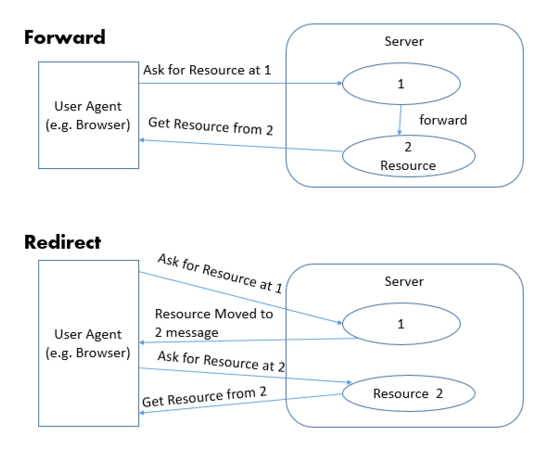
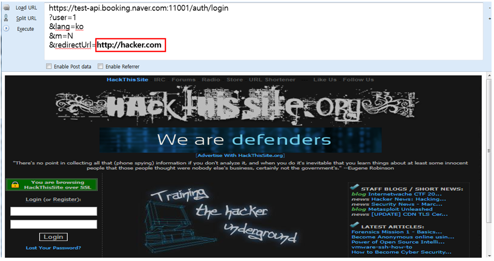

## 1. Vulnerability Description
#### URL Redirect
* URL Redirect is a redirectable vulnerability to any site, not the site intended by the user, due to incorrect parameter verification.
* An attacker can use a link where external input values, such as user input values, are expressed in the link to redirect users to an unintended malicious site, and attack such as spreading malicious codes and stealing personal information.

```
(Normal) https://www.example.com/function.jsp?redirect_url=comickr://agreeTermSuccess&cancel_url=comickr://agreeTermFailure

(Attack-URL Redirect) https://www.example.com/function.jsp?redirect_url=comickr://agreeTermSuccess&cancel_url=http://hacker.com/
```

#### URL Forward
* URL Foward is a forwardable vulnerability to any site, not the site intended by the user, due to incorrect parameter verification.
* From a Web Container's perspective, there is only page movement, and the web browser does not know that it has actually moved to another page.<br>
Therefore, the web browser will display the URL you first called and you will not be able to view the URL information of the page you moved.<br>
Due to the above reasons, security constraints do not work when including or forwarding, and an attacker can access unauthorized pages by using them when verifying incorrect parameters.

```
For example, suppose there is an administrator menu page with the following address, and the page displays “You do not have access authority when access is controlled by an unauthorized user.

http://www.example.com/admin.jsp
An attacker will make the following request to access a restricted administrator menu page and will be able to access the administrator menu page if the fwd argument is not verified.
http://www.example.com/function.jsp?fwd=admin.jsp
```


[ picture 1. The difference between Foward and Redirect ]


[ picture 2. url redirect Example of vulnerability ]


## 2. How to check vulnerability
* If you redirect/forward to the URL by putting an unintended URL/page in the place where the application name or domain address is included in the parameter, it can be considered vulnerable.


## 3. Vulnerability Countermeasure
#### Domain/page does not need to be changed
* If the domain/page to be redirected/forwarded does not need to be changed, it is fixed to the domain/page that is allowed to be redirected/forwarded.

#### When a domain/page is variable
* If the domain/page that is redirected/Forward is variable, make sure to accesss by writing the required domain/page in the White List
* You should not filter only simple strings, and there is a lot of possibility of bypass when using regular expressions, so it is safe to fix it as a domain/page and write it as a white list.
  * ex 1 : If you allow *.example.com, Attacker can bypass it as shown in www.hacker.com/example.com.
  * ex 2 : Existence of case bypassing url value by inserting IP information as well as domain - decimal value of IP on target server
     * Convert https://test.example.com/retest?mode=form&url=http://3627736398/ 3627736398 = 'google.com' IP (216.58.221.78) to decimal
     * http://www.aboutmyip.com/AboutMyXApp/IP2Integer.jsp?ipAddress=216.58.221.78


## 4.Sample Code
* Vulnerable Code

```java
......
String id = utils.nvl((String)session.getValue("id"));
String bn = utils.nvl(request.getParameter("gubun"));
String rd = utils.nvl(request.getParameter("redirect"));
if (id.length() > 0) {
    String sql = "select level from customer where customer_id = ?";
    conn = db.getConnection();
    pstmt = conn.prepareStatement(sql);
    pstmt.setString(1, id);
    rs = pstmt.executeQuery();
    rs.next();
    if ("0".equals(rs.getString(1)) && "01AD".equals(bn)) {
        response.sendRedirect(rd);
        return;
    }
} else {
    if ("01AD".equals(bn)) {
    response.sendRedirect(rd);
    return;
    }
}
......
```

* Safe Code

```java
......
String allowedUrl[] = {"/main.do", "/login.jsp", "list.do"};
......
String rd = utils.nvl(request.getParameter("redirect"));
try {
    rd = allowedUrl[Integer.parseInt(rd)];
} catch(NumberFormatException e) {
    return "It's a wrong approach.";
} catch(ArrayIndexOutOfBoundsException e) {
    return "It's a wrong input.";
}
if (id.length() > 0) {
......
 if ("0".equals(rs.getString(1)) && "01AD".equals(bn)) {
    response.sendRedirect(rd);
    return;
 }
} else {
 if ("01AD".equals(bn)) {
```

* JavaScript Filtering Example

```javascript
url = 'http://test.com/aaa/bbb?cccc'
url = decodeURIComponent(url)
 
u = new URL(url)
 
if (u.protocol !== 'http:' && u.protocol !== 'https:')
{
    alert("error");
}
 
//example.com, *.example.com
if(! u.hostname.match(/(?:^|\.)example\.com$/))
{
    alert("error");
```