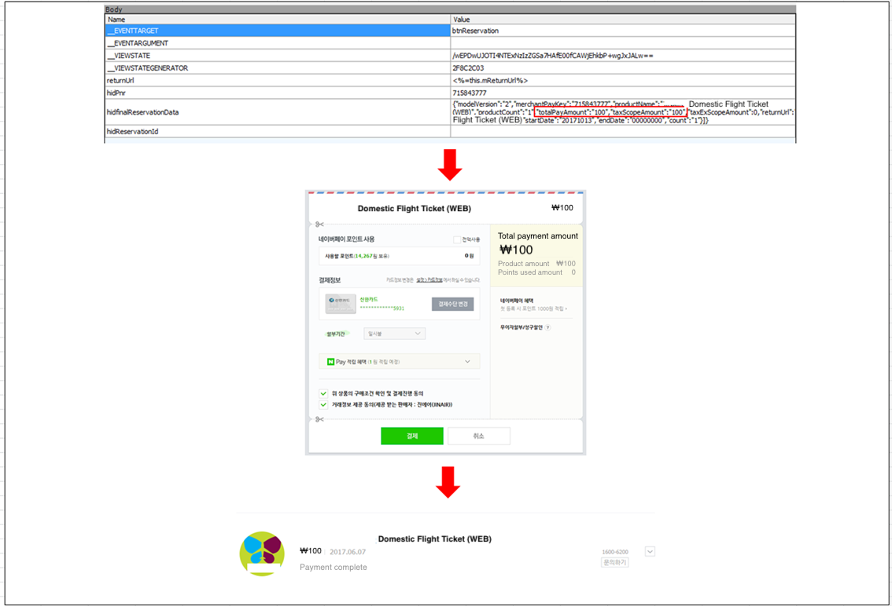

## 1. Vulnerability Description
* If the application does not validate input parameters, an attacker can manipulate them to bypass the service logic. This is called a Parameter Tampering vulnerability.
* An attacker can use various methods to change inputs such as parameters, cookies, environment variables, or hidden fields, and the service provider may not detect manipulation.
* If the amount, quantity, and service API are based on input values, an attacker can manipulate these inputs to lead maliciously. Therefore, sufficient encryption and integrity checks must be performed.
* Input parameters need to be used after verification by the server side.
* Figure 1. shows external linked payment communication of Naverpay, and you can see that the total payment amount has been tampered with by the change in the payment parameter.

**[Figure 1] Example of parameter tampering**




## 2. How to check vulnerability
* Check whether API of service are performed based on the external input parameter.
* Check whether the payment amount, quantity, and service API functions are manipulated through input parameter such as parameters, cookies, environment variables, and hidden fields.

## 3. Vulnerability Countermeasure
* From a security point of view, it is designed so as not to rely on external input values ​​as much as possible.
* Sensitive data should be stored on the server and security verification should also be run on the server.
* You must have a procedure to identify the input parameter at the point where an untrusted input value can enter the application.


## 4-1. Sample Code (JAVA)
* Vulnerable Code
  * The price of the purchased item is being processed by the user's web browser. Pricing information may be assigned an unintended value if the value is changed by the malicious user.
```java
<input type="hidden" name="price" value="1000"/>
<br/>Item: HDTV
<br/>Qty:<input type="hidden" name="quantity"/>
<br/><input type="submit" value="purchase"/>
......
try {
    // Set the price using parameter received from user
    price = request.getParameter("price");
    quantity = request.getParameter(“quantity”);
    total = quantity * Float.parseFloat(price);
} catch (Exception e) {
    ......
}
......
```

* Safe Code
  * Values ​​used for authentication, should not use user input values. Use internal values ​​of the server.
```java
<input type="hidden" name="price" value="1000"/>
<br/>Item: HDTV
<br/>Qty:<input type="hidden" name="quantity"/>
<br/><input type="submit" value="purchase"/>
......
try {
    // Set the price using the information the server has
    price = 1000;
    quantity = request.getParameter(“quantity”);
    total = quantity * Float.parseFloat(price);
} catch (Exception e) {
    ......
}
......
```
## 4-2. Sample Code (JSP)
* Vulnerable Code
  * The example below performs authentication by comparing the user information in the cookie with the current user information. It is vulnerable because an attacker can change the cookie information.
```java
if(getCookie(USER_TYPE).equals(ADMIN_USER))
{
    ...
    response.getOutputStream().print(userAddress);
    response.getOutputStream().print(userPhoneNumber);
    ...
}
```
* Safe Code
  * User's authentication information in plain text should not be stored in cookies, and sensitive information should be stored in the session of the WAS (Web Application Server) server as much as possible.
```java
if(((String)request.getSession().getAttribute(USER_TYPE)).equals(ADMIN_USER))
{
    ...
    response.getOutputStream().print(userAddress);
    response.getOutputStream().print(userPhoneNumber);
    ...
}
```