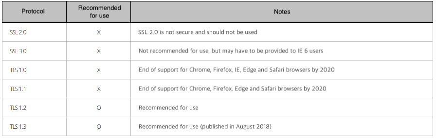

## 1. Vulnerability Description
* Using this vulnerability, it is possible to decrypt ciphertext by performing a padding oracle side-channel attack.
* POODLE is vulnerable when using Secure Socket Layer (SSL) version 3.

## 2. How to check vulnerability
* Check that you are using SSLv3.

<pre>
$ openssl s_client -connect 서버:443 -ssl2 (-ssl2 option may not be supported) 
$ openssl s_client -connect 서버:443 -ssl3
</pre>

## 3. Vulnerability Countermeasure
### 1) In case of INTERNET INFORMATION SERVICES (IIS)
Store protocol information after Microsoft Windows NT Server:

<pre>
HKey_Local_Machine\System\CurrentControlSet\Control\SecurityProviders\SCHANNEL\Protocols registry key. <br>
This key includes subkeys for 1.0, SSL 2.0, SSL 3.0 와 TLS 1.0. 
If you create a new DWORD value with the value of “00 00 00 00” in the server subkey to block the protocol, all these protocols can be disabled.
</pre>

* IIS crypto setup details: [link](https://support2.microsoft.com/ko-kr/help/187498/how-to-disable-pct-1-0-ssl-2-0-ssl-3-0-or-tls-1-0-in-internet-informat)

#### 2) In case of APACHE HTTP SERVER
* Disabling SSL 3.0 in mod_ssl
   * Option 1) Disable SSLv2 and SSLv3 (Use all other than SSLv2 and SSLv3)(/etc/httpd/conf.d/ssl.conf)
      * Setup information: SSLProtocol All -SSLv2 -SSLv3
   * Option 2) Disable all except for TLSv1.x
      * Setup information: SSLProtocol -All + TLSv1.2

#### 3) In case of NGINX SERVER
* Include the following in the Nginx configuration file:

<pre>
ssl_protocols TLSv1.2; 
sudo service nginx restart; // restart service (when running in Linux) 
</pre>

#### 4) In case of TOMCAT 
* SSL protocol to be used can be set via $TOMCAT_HOME/conf/server.xml:

```
< Connector port=""8443"" protocol=""org.apache.coyote.http11.Http11Protocol"" 

maxThreads=""150"" SSLEnabled=""true"" scheme=""https"" secure=""true"" 

clientAuth=""false"" sslProtocol=""TLS""/> 
```

## 4. Node
### SSL/TLS Usage Recommendations (as of December 2019)


