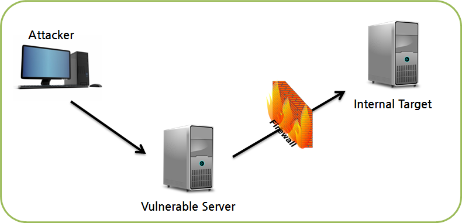
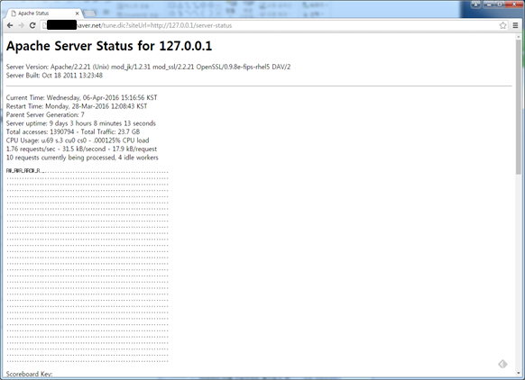

## 1. Vulnerability Description
* When the web server receives a user request, accesses another system, or receives the result, the attacker can bypass security equipment by sending a request to a domain controlled by an Access Control List (ACL) instead of the general domain. This allows the attacker to directly check the internal system without going through the usual security measures.
* The vulnerability is due to a lack of verification procedures for data entered by the user (such as domain).<br>
Since the server can perform the request instead, the risk is high because it can bypass the security equipment and continue attack traffic or additional actions inside.




## 2. How to check vulnerability
* When web servers interact with other servers, it is important to validate the input values. <br>
Verify that the page can be loaded by entering the internal IP or domain in the parameters that the server receives to handle the access function.




## 3. Vulnerability Countermeasure
### 3.1. Process only allowed URLs
* To ensure that the server only accesses a specific URL and ignores other requests, you can configure the server to restrict access to the desired URL and discard or reject any other incoming requests.

### 3.2. Processing for unacceptable URLs
* If the service requires checking multiple domains, it is difficult to manage with the allowed URL list. Therefore, This needs a policy to block domains that are not allowed access.
* If it is an internal IP band or a URL classified as an internal domain, it must be handled to stop it from working.

### 3.3. Do not use unnecessary parameters
* Servers accessing a fixed domain do not need to receive information about other domains. It is recommended that you only handle it internally so that user cannot verify it.

## 4. Sample Code
* Vulnerable Code

```shell
...
$ch = curl_init($_get['url']);
curl_setopt($ch, CURLOPT_RETURNTRANSFER, true);
curl_setopt($ch, CURLOPT_HEADER, 0);
$data = curl_exec($ch);
curl_close($ch); 
```

* Safe Code

```shell
...
$url = $_get['url'];
$url = check_url($url);  // check_url function is a function that verifies and returns the input value.  
$ch = curl_init($url);
curl_setopt($ch, CURLOPT_RETURNTRANSFER, true);
curl_setopt($ch, CURLOPT_HEADER, 0);
$data = curl_exec($ch);
curl_close($ch);
```
