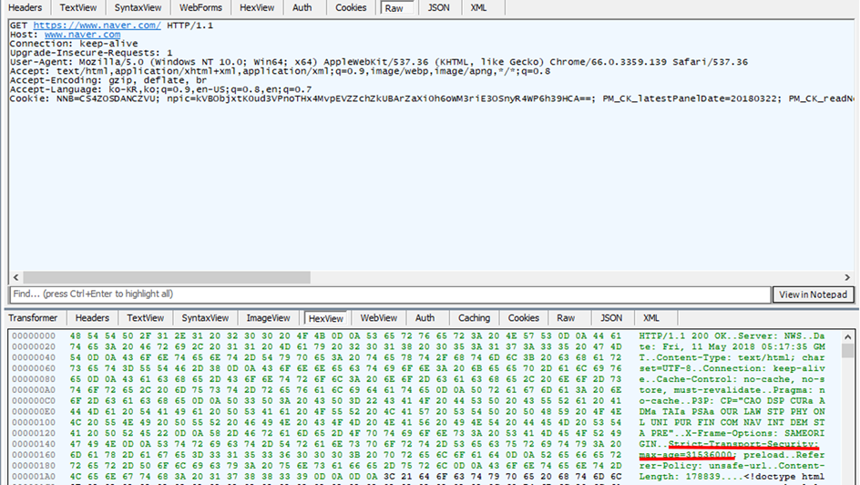

## 1. Vulnerability Description
* By default, all HTTP traffic on the web is sent as a plaintext.
For that reason, anyone can view all your passwords, credit cards, and URL information when they intercept traffic in the middle (see Snipping. Notes).
* If SSL is not applied to sensitive features such as login and password change, communication channel sniping can expose sensitive data to unauthorized users.
* Therefore, use secure channels such as SSL or HTTPS when exporting sensitive information over a communication channel.

## 2. How to check vulnerability
* Verify that the main pages communicate with HTTPS.
* Check whether Http Strict Tansport Security (HSTS) is applied.

[ picture 2. HSTS verification example ]

## 3. Vulnerability Countermeasure
* Use SSL/TLS security channels when exporting sensitive information over a communication channel.
* Apply HSTS for SSL enforcement and SSLStrip protection.
* If you are using a secure channel such as HTTPS, or if you store sensitive data in your browser cookies, you can set security attributes on the cookie object to prevent sensitive information disclosure (such as using an Ex. setSecure (true) method).
Cookies with secure properties are not sent to HTTP, so encryption must be applied to send cookies that store sensitive data to HTTP.
