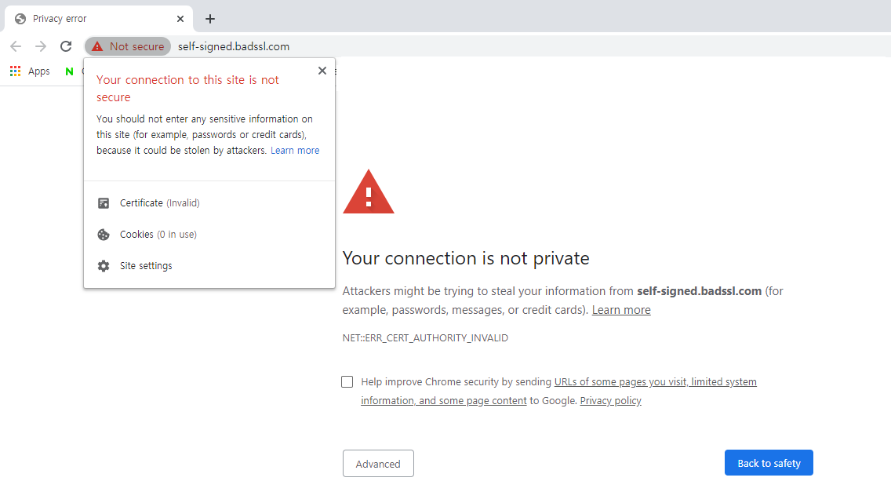
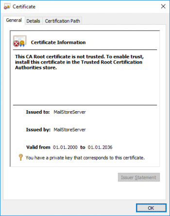

## 1. Vulnerability Description
* Using self-signed certificates can be vulnerable to security because there is no certification authority(CA) to validate them.

## 2. How to check vulnerability
* Connect to the site using the certificate and check the certificate's issuance target, issuer, expiration date, etc.
* When using a self-signed certificate, the web browser will output a warning message as shown below.

## 3. Vulnerability Countermeasure
* Use a certificate issued by an authorized authority.
