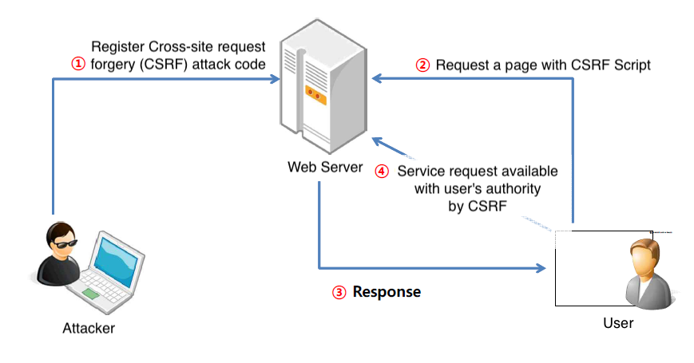
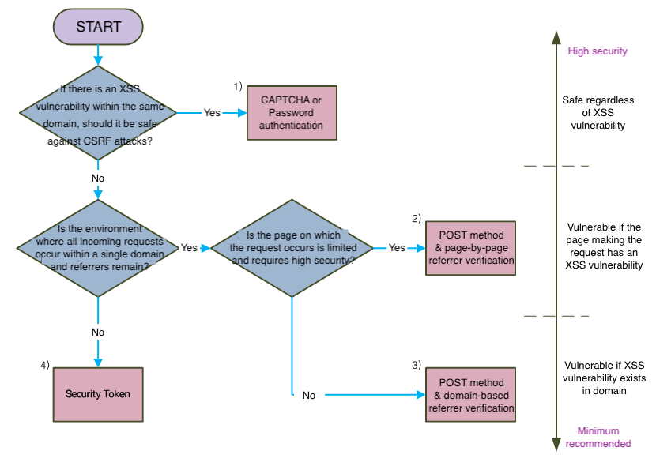

## 1. Vulnerability Description
* CSRF is an attack that forces an Internet user to request an attacker's intended behavior (modification, deletion, registration, etc.) to a particular website regardless of their will.<br>
If a user request is processed by the server without checking whether it is actually delivered through the service, the request generated by a well-written script is made with the user's privileges.
* Cross Site Request Forgery is based on the following scenarios: <br>
These attacks allow you to automatically write bulletin boards, subscribe automatically, and steal other users' rights to execute important functions.<br>
Also, it is possible to write advertising comments on other people's blogs.



* CSRF attacks are possible in environments where the following conditions are met:
  * Services that have content manipulative functions such as write/change (Reading function is not subject to CSRF vulnerability)
  * Victim is logged in to the service that sends forged requests
  * Victim accesses pages with attack codes written by the attacker


## 2. How to check vulnerability
* A CSRF attack usually generates an HTTP request using the following tags, which are triggered by Action through the GET Method:

```

<script src=…. />
<iframe src=…… />
<frame src=…… />
<meta ….. />
```

* In addition to this, CSRF attack that generates POST method through Javascript technique is possible as follows.

```
<form name="frm" method="POST" … > …</form>      <script>frm.submit();</script>
<script> var req = new ActiveXObject("Microsoft.XMLHTTP");     req.open("POST",  …);     req.send(null); </script>
```


## 3. Vulnerability Countermeasure
### 3.1. CSRF Countermeasures
* Only image extensions such as jpg, gif, png, and bmp are allowed for values entered in the  tag's src property.
* When writing, create Token in the requested file and check Token validity in the Action file.
* All action files, such as writing bulletin boards and changing settings, use POST Method and check Referer.
* When checking Referer, check whether to start http://www.target.com/, not including www.target.com.

### 3.2. CSRF solutions and its problems

Countermeasure | Purpose | Vulnerability / Problem | Note
-- | -- | -- | --
Using POST Method | Defend against an attack code by GET query | <form id=‘frm’ method=‘POST’ action=‘CSRF attack code’ ><script>frm.submit()</script></form> | - Unable to defend attacks using form.submit()<br>- Unable to defend AJAX queries where requests occur
Referrer Verification | POST Method Vulnerability Alternative | Most attack codes can be defended only by referrer check |- Problems exist in browsers that do not deliver referrer values in Web plugin such as flash.<br>- It can be occured the web browser dependencies and Mobile program compatibility problem.
Using Security Token | Referrer Problem Alternative | Requires review of vulnerabilities resulting from the creation/issuance/verification/disposal of Security Token | - Creating/issuing/verifying/disabling security Token is key<br>- Using security Token on the Web<br>- Using security Token in web plugin such as flash<br>- Using security Token in mobile(independent) programs
Secondary Verification (CAPCHA, Password Authentication) | Inserts a secondary validation page for user awareness | -- | --

### 3.3. Countermeasures for each use environment
* Among the defense techniques against CSRF attacks, the recommended countermeasures are arranged in order of safety.

 

## 4. Sample Code
### 4.1. Creating a CSRF token
```js
// Any type of request may have a basically CSRF vulnerability.
 
// generate a CSRF token when logging in or requesting a work screen and save it to the session.
session.setAttribute("CSRF_TOKEN",UUID.randomUUID().toString());
 
// When requesting work screen, attach CSRF token to the screen and send
<input type="hidden" id="csrf" name="csrf" value="${CSRF_TOKEN}" />
```

### 4.2. Check CSRF token value

```java
// check the CSRF token value using intercept for POST method request.
if ( ! request.getMethod().equalsIgnoreCase("post")) {
    return true;
}
else {
    if( request instanceof MultipartHttpServletRequest) {
                Enumeration<String> names = request.getParameterNames();
                while( names.hasMoreElements()) {
                    String paramName=names.nextElement();
                    if( paramName.equals("csrf")) {
                            String paramValue=request.getParameter(paramName);
                            // If the CSRF value passed to the parameter and the CSRF_TOKEN value stored in the session are the same,
                            if ( paramValue.equals( request.getSession().getAttribute("CSRF_TOKEN"))) {
                                    // forward the request to the Controller.
                                    return true;
                            }
                            // If the CSRF_TOKEN value does not match, it is recognized as a CSRF attack and processed, or moved to the page used for the original request.
                            response.sendRedirect("write.do");
                            return false;
                    }
                }
        }
}
```
