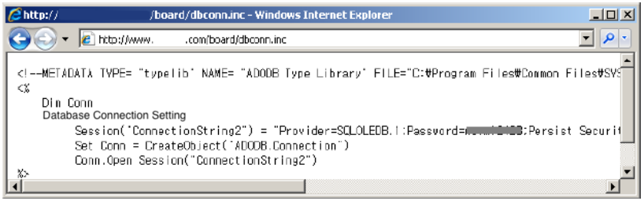
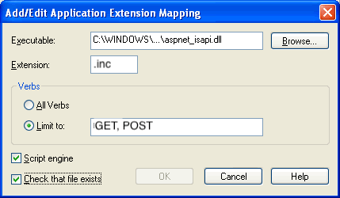
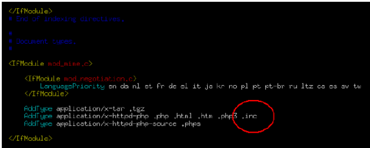

## 1. Vulnerability Description
* Due to the nature of the Server Side Script, the Requester (Client) is unable to verify the source code under normal conditions because it is a browser that checks the results processed by the compiler.<br>
However, there may be vulnerabilities where source code is exposed to the outside world for a variety of reasons, and the acquired source code allows hackers to obtain sensitive information such as the path to class files, the path used to upload and download files, and the string of database connections.

#### The main causes of source code exposure are:

### 1.1 If you do not parse a server-side script
* Server Side Script file format normally handled by the web server, but the source is exposed in the form of a plain sentence because the extension is not registered in the parsing list.<br>
The most common example is unparsed inc files.<br>
When programming the web, you often use your library as it is, and you need to set an extension to parse it on the web server to handle it properly, but not the inc file.



### 1.2. Bug of Applications
* When a particular application's bug exposes the source code:

```
- www.target.com//notice/config.jsp
- www.target.com/notice/config.jsp/
- www.target.com/notice/config.jsp//
- www.target.com/notice/config.jsp%00
- www.target.com/notice/config.jsp%23
- www.target.com/notice/config.jsp%5c
- www.target.com/notice/config.%61%73%70
- www.target.com/notice/config.JSP
```

## 2. How to check vulnerability
* For convenience, if the developer writes down the password or key information on the server in an annotation, an attacker can access the system using the information exposed to the source code.

## 3. Vulnerability Countermeasure
### 3.1 If you do not parse the Server Side Script
* All Server Side Scripts located within the Web server and in normal use must be set up to register extensions so that the Web server can parse normally.

#### (1) IIS
* Administrative Tools - Internet Information Services - Website Properties – Home Directory – Configuration – Add
  * Example: how to register an enc file
  


#### (2) Apache
* Modify the httpd.conf file
  * ex : how to register an inc file
  


 
## 4. Example Code
* When developing a program, information such as user accounts or passwords that are left on the annotation should be clearly deleted after development is completed.
* Vulnerable Code

```java
// Password for administrator is ""tiger"" <-- A password is written on the annotation.
public boolean DBConnect() {
    String url = ""DBServer"";
    String password = ""tiger"";
    Connection = null;
  
    try {
        con = DriverManager.getConnection(url, ""scott"", password);
    } catch {
        ...
    }
}
```

* Safe Code

```java
// the password written in the source annotation for debugging must be deleted.
public Connection DBConnect(String id, String password) {
    String url = ""DBConnect"";
    Connection conn = null;
    try {
        String CONNECT_STRING = url + "":"" + id + "":"" + password;
        InitialContext ctx = new InitialContext();
        DataSource datasource = (DataSource) ctx.lookup(CONNECT_STRING);
        conn = datasource.getConnection();
    } catch (SQLException e) {
        ...
    }
    return conn;
}
```
