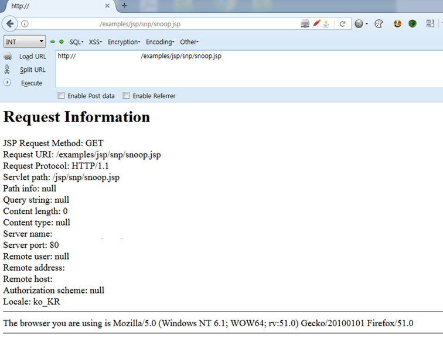
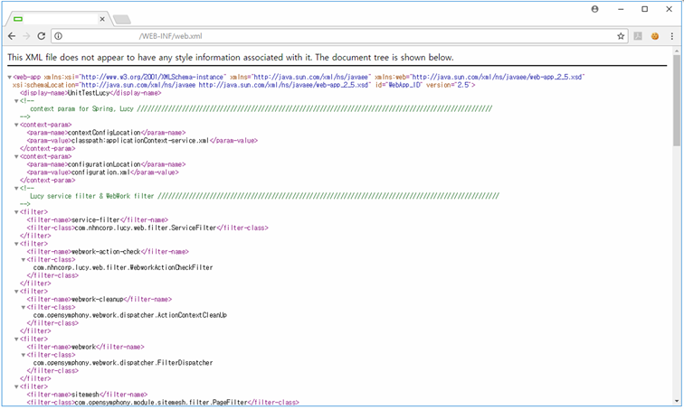

## 1. Vulnerability Description
* Web servers may have files that are essential to the existence of a variety of files, while there are some files that are not required for service.
* **All files that are unnecessary to operate the Web server should be deleted or managed** by another system.<br>
If management is insufficient, **There is a possibility that system information will be exposed and more likely to occur**.<br>
In particular, **Remove unnecessary pages, such as backup/test/default pages, because they can be fatal to security by leaking important information such as web server, web application, and DB setup information.



[ picture 1. Example of Unnecessary Pages]


## 2. How to check vulnerability
#### 2.1 Verify that unnecessary files exist on the web directory being serviced through the Explorer(Windows) or via command(Unix).
* The following is a list of unnecessary files on the Web server:

File | Content
-- | --
Web src file | Server Side Script files, such as *.asp~, *.inc, *.phps and etc. That is fatal if DB Connection information is included.
Back file| Expose the entire source code of the web server, including *.bak, *.zip, *.tar, *.tar.gz, *.tgz and etc.
Log file | Account/Time/Access information such as *.log, *.log and etc, may be exposed.
Test file | Server Side Script files, such as test.asp, test.jsp, 1.php and etc. That is created by a web programmer or administrator to check whether the web server is working properly, parsing well, and database connection is good.

#### 2.2 After setting up the Web server, verify that the default directory or default page exists.

Web Server | Content
-- | --
apache | Check whether cgi-bin, manual, and usage directory exists.
iis | Check whether iissamples, scripts, iisHelp, IISAdmin, _vit_bin, Printers exist.

#### 2.3. Check whether the web application configuration information and the Java class files are accessible within the WEB-INF directory.
* In particular, web.xml files, called "Deployment Descriptor" in the WEB-INF directory, provide specific deployment information about web servers such as URL mapping, servlet properties, welcome file lists, MIME format, error pages, security, etc.

File | Content
-- | --
Files in WEB-INF | Verify that you have access into WEB-INF/ files, such as WEB-INF/web.xml files.



[ picture 2. Example of WEB-INF Information Disclosure Vulnerability ]


## 3. Vulnerability Countermeasure
* Delete files from the server that are not required to operate the web server.
* Backup files should be backed up regularly in a safe place by establishing a backup plan, and the web server should be created with the least amount of files needed for operation.
* If it is not necessary to operate a web server, but it must be located on a web server, it should be located at a higher path than the Web Root and set appropriate permissions to prevent access from the Web.
* In case of key information disclosure within WEB-INF, modify it so that it is not accessible within that directory as shown below.
* Set the Apache setup file /conf/httpd.conf to modify it so that it does not have access to the directory on the web.

```
<Location /WEB-INF>SetHandler WEB-INFOrder deny,allowDeny from all</Location>
```
