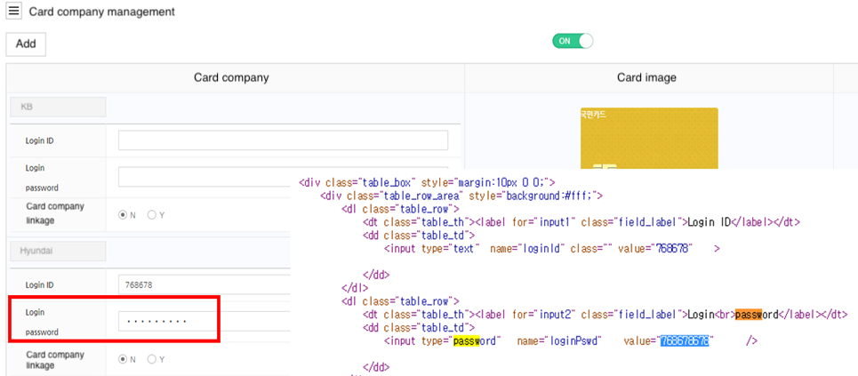
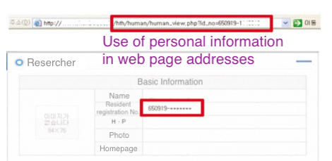
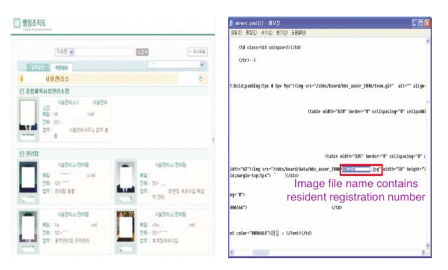

## 1. Vulnerability Description
* Exposure of important information means that information is left unattended on the Internet so that users can acquire other people's information while using the Internet normally without using special methods such as hacking.
* Important information, such as password and credit card information, may be exposed to others if it is not masked or if it exists as a plain text on the file name or source code.

## 2. How to check vulnerability
* Check if there is any unmasked important information displayed on the screen such as source code, file name, and URL.
* The examples in which important information is exposed are as follows.

#### Types of personal information exposure caused by not masking important information through the input field or source code

#### Types of personal information exposure due to website design errors (Use personal information in the homepage address (URL) to identify and distinguish information on a page or post)

#### Types of personal information exposure accidents due to failure to check the presence or absence of personal information while uploading related files such as announcements

#### Types of personal information exposure accidents in which personal information is used as a file name when saving photo information or personal information is displayed in the source code of the homepage

## 3. Vulnerability Countermeasure
* In the case where personal information is included in the source code or URL that is basically disclosed on the homepage, make the part where personal information is exposed *(masked).
* If personal information exposed through file contents, file name, etc. is found, the page with personal information must be deleted, or the exposed part of personal information must be *(masked) and posted again.

